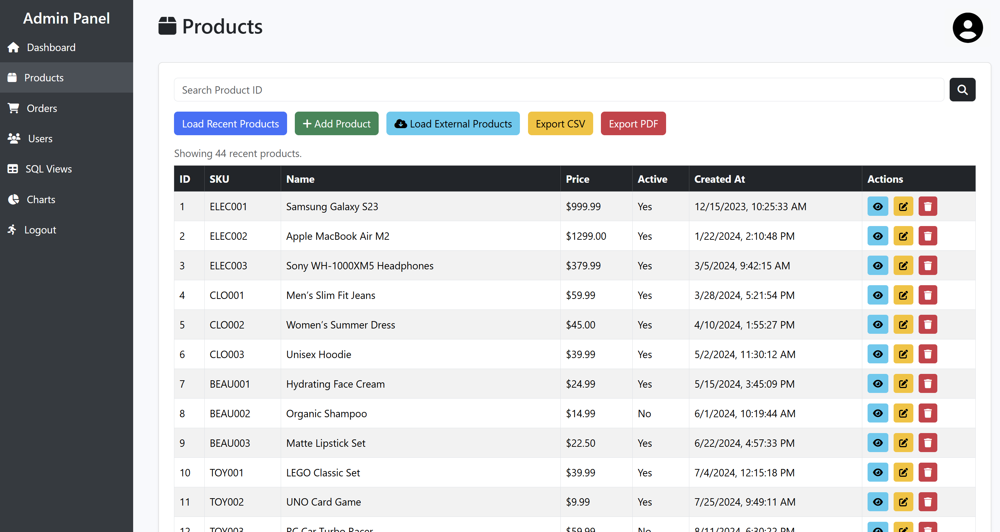
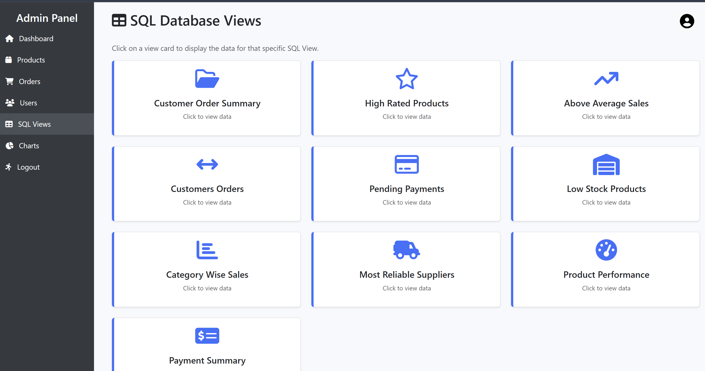
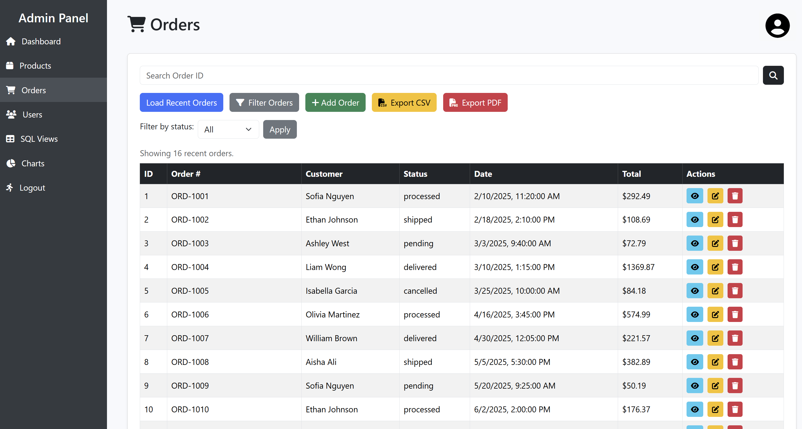
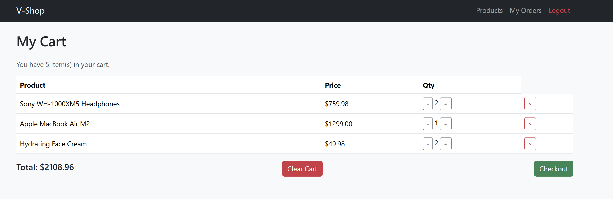

# E-Commerce Inventory & Order Management System

## Overview

This project is a **full-stack e-commerce inventory and order management system** that allows administrators to manage products, Users, and orders while providing customers with a seamless shopping experience.

## Admin Features

### Product Management:

* **CRUD Operations:** Add, edit, update, and delete products **manually**.
* **API Integration:** Import external products automatically via **DummyJSON API**.
* **Data Integrity:** Prevent duplicate entries with **SKU checks**.

### Order Management:

* **Order Visibility:** View and manage **all customer orders**.
* **Status Updates:** Update order statuses (e.g., Pending, Shipped, Delivered).

### User Management:

* **Customer View:** View a list of registered customers.
* **Admin Security:** Securely manage admin credentials using **hashed passwords** (bcrypt).

### Data Export:

* **Reporting:** Export product and order data to **CSV or PDF** for detailed reporting.

### Analytics & Visualization:

* **Interactive Charts:** View sales and inventory trends via **interactive charts (Chart.js)**.

### Security & Session Management:

* **Access Control:** **Role-based access** using **JWT** (JSON Web Tokens).
* **Protection:** Prevent unauthorized access to sensitive admin pages.

## Customer Features

### User Registration & Login:

* **Secure Registration:** Secure account creation with **hashed passwords**.
* **Authentication:** Login with **JWT-based session management**.

### Product Browsing:

* **Filtering:** View products by category using the **filter functionality**.
* **Details:** See product details including **price, description, and stock availability**.

### Shopping Cart:

* **Management:** Add products to cart.
* **Editing:** Update quantity or remove items from the cart.

### Order Placement:

* **Ordering:** Place orders for selected products.
* **History:** View **order history** and detailed order information.

### Responsive UI:

* **Navigation:** Easy-to-navigate product listings.
* **UX/UI:** Interactive and **user-friendly front-end pages**.

### Secure Experience:

* **Authorization:** **Session and role-based security** prevents unauthorized access to admin features.

## Technologies Used

* **Frontend:** HTML, CSS, JavaScript, Bootstrap, Chart.js
* **Backend:** Node.js, Express.js, `axios` (DummyJSON API requests), `jsonwebtoken` (JWT), `bcrypt`, `express-session`, `helmet`, `express-validator`, `multer`
* **Database:** MySQL (`mysql2`)
* **Utilities & Others:** `body-parser`, `cors`, `dotenv`, `json2csv`, `pdfkit`, `nodemon`
* **External Integration:** DummyJSON API

## Setup & Installation

### 1. Clone the Repository

```
git clone https://github.com/Khushi-Patel-code/E-Commerce-Inventory-Order-Management-System-Website
cd E-Commerce-Inventory-Order-Management-System-Website
git pull origin main
```
### 2. Install Dependencies

Run the following commands to install all required packages:

```
npm install jsonwebtoken bcrypt axios
npm install express mysql2 body-parser cors dotenv ejs chart.js
npm install nodemon --save-dev
npm install express-session json2csv pdfkit helmet express-validator multer connect
```

### 3. Setup Database

* Make sure **MySQL Workbench** is open and run all provided **SQL files**.
* Update your database connection details in `db/connection.js`.
* Ensure `.env` file variables match your database configuration:
    * `DB_HOST` → `localhost`
    * `DB_USER` → `root`
    * `DB_PASS` or `DB_PASSWORD` must match across `.env` and `connection.js`.
    * **Important:** Do not include `#` in your MySQL password. If necessary, enclose the password in double quotes.

### 4. Run the Application

```
npm run dev   # for development mode
# OR
npm start     # for production mode
```

### 5. Admin Login Setup

There is no admin creation page. To create a new admin password:

1.  Run the hash generation script:
    ```bash
    node generate-hash.js
    ```
2.  Copy the generated hash and update the admin user in your SQL file or directly in the database:
    ```sql
    UPDATE users
    SET password_hash = 'paste-generated-hash-here'
    WHERE email = 'khushi.patel@example.com';
    ```
3.  Re-run the SQL scripts (if modifying the file) and log in with the plaintext password you set in `generate-hash.js`.
## Usage

### 1. Access the Website

* Open your browser and navigate to the local server (default: `http://localhost:3000`).
* **Note:** Use **separate browsers** or **incognito mode** for admin and customer testing to avoid JWT session conflicts.

### 2. Admin Panel

* Log in using the admin credentials (set up via `generate-hash.js` as described in **Setup & Installation**).
* **Manage** products, orders, and users.
* **Fetch external products** via the integrated API.
* **Generate reports** in CSV or PDF format using the export functionality.
* **Monitor dashboard charts** for inventory and order statistics.

### 3. Customer Panel

* Register or log in with a customer account.
* **Browse products** by category and search for specific items.
* **Add products to cart** and place orders.
* **View past orders** and order statuses.

### 4. Additional Notes

* Ensure the **database is running** before accessing the website.
* Changes made in the admin panel (like adding products or categories) are **immediately reflected** on the customer side.
* For testing purposes, **multiple customer accounts** can be created to simulate real-world usage.

## API Endpoints

### Products

| Method | Endpoint | Description | Access |
| :--- | :--- | :--- | :--- |
| `GET` | `/products` | Retrieve all products from the database. | Public |
| `GET` | `/products/:id` | Retrieve details of a specific product. | Public |
| `POST` | `/products` | Add a new product. | Admin only |
| `PUT` | `/products/:id` | Update an existing product. | Admin only |
| `DELETE` | `/products/:id` | Delete a product. | Admin only |

### External API Integration

| Method | Endpoint | Description | Access |
| :--- | :--- | :--- | :--- |
| `GET` | `/external-products/fetch` | Fetch products from **DummyJSON API** and save them into the local database. Automatically creates categories if they don’t exist and skips duplicates based on SKU. | Admin only |

#### Example Success Response:

```json
{
  "message": "Successfully inserted 20 external products."
}
```

## Repository Structure
```
.
├── README.md
├── app.js
├── controllers
│   ├── adminController.js
│   ├── authController.js
│   ├── categoriesController.js
│   ├── chartController.js
│   ├── customerController.js
│   ├── externalController.js
│   ├── inventoryController.js
│   ├── orderController.js
│   ├── paymentController.js
│   ├── productController.js
│   ├── reviewsController.js
│   ├── supplierController.js
│   ├── viewController.js
│   └── warehouseController.js
├── db
│   └── connection.js
├── generate-hash.js
├── package-lock.json
├── package.json
├── public
│   ├── Admin
│   │   ├── admin-charts.html
│   │   ├── admin-dashboard.html
│   │   ├── admin-orders.html
│   │   ├── admin-products.html
│   │   ├── admin-profile.html
│   │   ├── admin-users.html
│   │   ├── admin-views.html
│   │   └── view-data.html
│   ├── cart.html
│   ├── css
│   │   ├── customerLog.css
│   │   ├── customerReg.css
│   │   ├── dashboard.css
│   │   ├── indexStyle.css
│   │   ├── sketchFloat2.gif
│   │   └── staffStyles.css
│   ├── customer-dashboard.html
│   ├── customer-login.html
│   ├── customer-orders.html
│   ├── customer-products.html
│   ├── customer-register.html
│   ├── index.html
│   ├── js
│   │   ├── admin-charts.js
│   │   ├── admin-dashboard.js
│   │   ├── admin-profile.js
│   │   ├── cart.js
│   │   ├── customer-auth.js
│   │   ├── customer-order.js
│   │   ├── customer-products.js
│   │   ├── products.js
│   │   ├── router.js
│   │   └── staff-auth.js
│   ├── orders-test.html
│   ├── products.html
│   ├── staff-login.html
│   └── styles.css
├── routes
│   ├── admin.js
│   ├── auth.js
│   ├── categories.js
│   ├── charts.js
│   ├── customerProducts.js
│   ├── customers.js
│   ├── exports.js
│   ├── external.js
│   ├── inventory.js
│   ├── orders.js
│   ├── payments.js
│   ├── products.js
│   ├── reviews.js
│   ├── suppliers.js
│   ├── views.js
│   ├── warehouse.js
│   └── webservice.js
├── Screenshots
├── utils
│   └── authMiddleware.js
└── validators
    ├── categoryValidator.js
    ├── customerValidator.js
    ├── handleValidation.js
    ├── inventoryValidator.js
    ├── orderValidator.js
    ├── paymentValidator.js
    ├── productValidator.js
    ├── reviewValidator.js
    ├── supplierValidator.js
    └── warehouseValidator.js
```

## Screenshots and UI


### Admin Side
<table>
  <tr>
    <td></td>
    <td></td>
  </tr>
  <tr>
    <td></td>
    <td></td>
  </tr>
  <tr>
    <td></td>
    <td></td>
  </tr>
</table>

### Customer Side
<table>
  <tr>
    <td></td>
    <td></td>
  </tr>
  <tr>
    <td></td>
    <td></td>
  </tr>
</table>

## Acknowledgements
- This project was developed as part of an academic group assignment at Ontario Tech University for Data Management Systems Course.
- External APIs: [DummyJSON](https://dummyjson.com/) for product data integration.
- Libraries & Frameworks: Express, MySQL2, Axios, bcrypt, jsonwebtoken, EJS, Chart.js, Bootstrap, and other npm packages used in the project.
- Special thanks to all group members: Khushi Patel, Prabhnoor Saini, Jayden Mallari and Rabab Raza for their contributions.